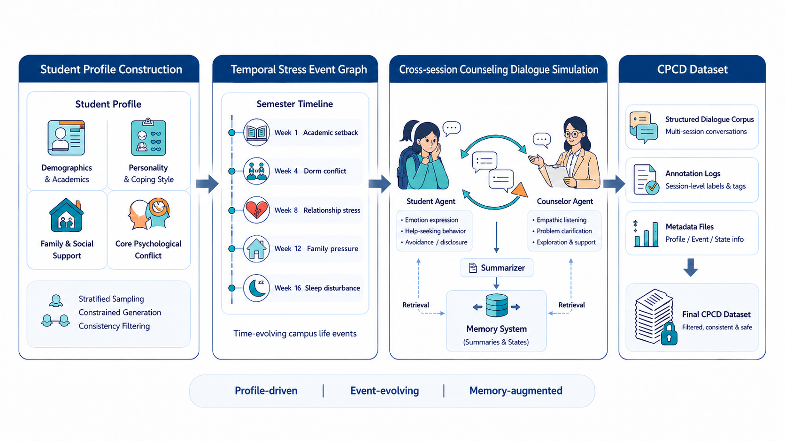

<h1 align="center">Psy-Chronicle</h1>
<h3 align="center">A Structured Pipeline for Synthesizing Long-Horizon Campus Psychological Counseling Dialogues</h3>

<p align="center">
  <a href="https://github.com/EdwinUSTB/Psy-Chronicle"></a>
  <a href="https://github.com/EdwinUSTB/Psy-Chronicle"></a>
  <a href="https://modelscope.cn/collections/gouchaogui/Psy-Chronicle"></a>
</p>


This is the official GitHub repository for **Psy-Chronicle: A Structured Pipeline for Synthesizing Long-Horizon Campus Psychological Counseling Dialogues**.

Psy-Chronicle is a structured data-generation framework for synthesizing long-horizon campus psychological counseling dialogues. Unlike single-turn or short multi-turn counseling datasets, Psy-Chronicle models counseling as a semester-level process that connects student profiles, campus stress events, cross-session counseling interactions, and structured memory updates.

Based on Psy-Chronicle, we release:

- **CPCD**: a Chinese long-horizon campus psychological counseling dialogue dataset.
- **CPCD-Bench**: a benchmark for evaluating long-horizon campus counseling capabilities.
- **CPCD-Chat**: Qwen3-based models fine-tuned on CPCD.

> **Important note**: CPCD is a synthetic research dataset. It should not be used as a substitute for professional psychological counseling, clinical diagnosis, treatment, or crisis intervention.

## News
- [Coming soon]Paper preprint is available in this repository.
- [2026.5.14]Dataset, benchmark, and models are available on ModelScope.


## Links

- **Repository**: <https://github.com/EdwinUSTB/Psy-Chronicle>
- **ModelScope Collection**: <https://modelscope.cn/collections/gouchaogui/Psy-Chronicle>
- **Paper**: Preprint / arXiv version


## CPCD Dataset

CPCD is organized by student trajectory. Each trajectory contains a student profile, a temporal stress event graph, cross-session counseling dialogues, and structured memory summaries.

| Component | Value |
|---|---:|
| Student Profiles | 100 |
| Counseling Dialogue Units | 90,000 |
| Chinese Characters | 11,452,843 |
| Avg. Characters / Dialogue Unit | 127 |
| Student-side Characters | 3,246,475 |
| Counselor-side Characters | 8,206,368 |

The campus stress domains include academic pressure, interpersonal relationships, career development, family and financial stress, and physical and mental health.

## CPCD-Bench

CPCD-Bench evaluates long-horizon campus counseling ability from three perspectives:

| Task | Input | Evaluation Focus | Samples |
|---|---|---|---:|
| Session-level Response (SR) | Student profile, current context, historical memory | Empathy, coherence, professionalism, history utilization | 99 |
| Memory Recall (MR) | Student profile, complete counseling history | Long-horizon retrieval, factual accuracy, temporal consistency | 40 |
| Temporal-Causal Reasoning (TCR) | Student profile, complete counseling history | Temporal ordering, event-chain organization, causal reasoning | 20 |

## Models

We fine-tune Qwen3 base models on CPCD and release the **CPCD-Chat** series:

- **CPCD-Chat-4B**
- **CPCD-Chat-8B**

The released datasets, benchmark resources, and models are available in the ModelScope collection:

<https://modelscope.cn/collections/gouchaogui/Psy-Chronicle>

## Repository Structure

```text
.
├── conversation/                    # Raw counseling session dialogues
│   └── {session_num}/
│       └── consultation_events_{case_id}.json
│
└── eval_task_info/                  # CPCD-Bench tasks and evaluation scripts
    ├── SRG/                         # Session-level Response
    ├── memory_recall/               # Memory Recall
    ├── TCR/                         # Temporal-Causal Reasoning
    └── full_session/                # Complete session histories
```

## Setup

```bash
conda create -n psy-chronicle python=3.10
conda activate psy-chronicle
pip install openai pandas tqdm
```

The evaluation scripts use an OpenAI-compatible client through OpenRouter by default.

```bash
export OPENROUTER_API_KEY="your_openrouter_api_key"
```

## Running Evaluation

Example for Session-level Response:

```bash
python eval_task_info/SRG/srg_eval_online.py \
  --tasks "./eval_task_info/SRG" \
  --rubric "./eval_task_info/SRG/rubric.md" \
  --full-session-dir "./eval_task_info/full_session" \
  --target-model "model/identifier" \
  --judge-model "openai/gpt-5.2" \
  --output "./outputs/sr_eval.jsonl" \
  --csv-output "./outputs/sr_eval.csv"
```

Offline evaluation scripts are also provided for scoring pre-generated model responses.

## Citation

If you find this repository useful, please cite our work:

```bibtex
@misc{gou_psychronicle,
  title  = {Psy-Chronicle: A Structured Pipeline for Synthesizing Long-Horizon Campus Psychological Counseling Dialogues},
  author = {Chaogui Gou and Jiarui Liang},
  note   = {Preprint},
  url    = {https://github.com/EdwinUSTB/Psy-Chronicle}
}
```

## Ethical Use

CPCD is constructed from synthetic student profiles, temporal stress event graphs, and simulated counseling dialogues rather than real counseling records. The dataset is intended for research and evaluation only.

Models trained or evaluated with CPCD may still generate inappropriate, incomplete, or overly generic responses, especially in high-risk mental-health situations. Any deployment-oriented use should include professional review, safety evaluation, and clear user-facing disclaimers.
